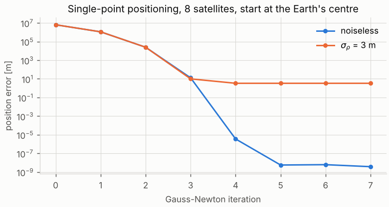
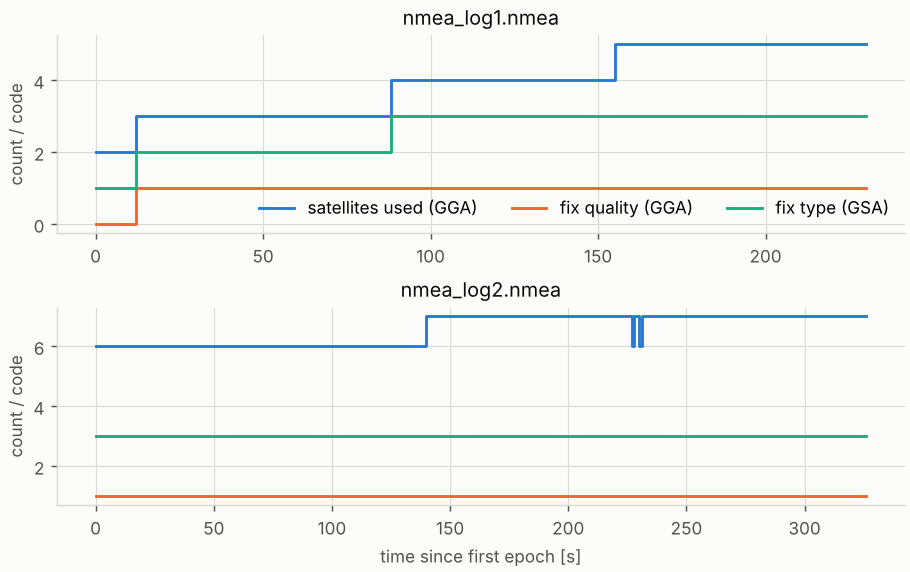

# 1 · GNSS fundamentals: how a fix is computed and how it is reported

A GNSS receiver turns timing measurements to satellites into a position, then reports that position as
lines of text. This chapter follows both halves: the least-squares problem the receiver solves, and the
NMEA 0183 sentences in which it publishes the answer. Everything later in the module starts from these
sentences (or from the ROS `NavSatFix` messages built from them).

Code: [`nmea.hpp`](../cpp/include/sensor_fusion/nmea.hpp), [`gnss.hpp`](../cpp/include/sensor_fusion/gnss.hpp) ·
tests: [`test_nmea.cpp`](../cpp/tests/test_nmea.cpp), [`test_gnss.cpp`](../cpp/tests/test_gnss.cpp) ·
notebook: [`01_gnss_fundamentals.ipynb`](../2_notebooks/solutions/01_gnss_fundamentals.ipynb)

---

## 1.1 What a receiver measures

Every GNSS satellite (GPS, GLONASS, Galileo, BeiDou) carries an atomic clock and continuously transmits a
ranging code together with its orbit (the *ephemeris*) and the offset of its own clock. The receiver
correlates the incoming code with a local replica and so measures **when** the signal it is receiving now
was transmitted, according to the satellite clock. Multiplying the apparent travel time by the speed of
light $c$ gives a range — but a biased one, because the receiver's own clock is a cheap quartz oscillator
that is off by an unknown $\delta t_r$. One microsecond of receiver clock error is 300 m of range, so the
offset cannot be ignored; it is estimated together with the position. The biased range is called the
**pseudorange**:

$$
\rho_i = \lVert \mathbf{s}_i - \mathbf{r} \rVert + b + \varepsilon_i, \qquad b = c\,\delta t_r .
\tag{1.1}
$$

Here $\mathbf{s}_i$ is the satellite position at transmission time (computed from the ephemeris),
$\mathbf{r}$ the receiver position, both in the Earth-centred Earth-fixed frame $\{E\}$ (chapter 2), and
$\varepsilon_i$ collects everything else:

- residual satellite clock and ephemeris errors (broadcast corrections are not perfect);
- ionospheric delay (dispersive, larger at low elevation; dual-frequency receivers remove most of it);
- tropospheric delay (non-dispersive, modelled from elevation and a standard atmosphere);
- multipath (reflections off buildings and the ground) and receiver noise.

The receiver also corrects for the rotation of the Earth during the signal's flight (the Sagnac effect) and
for relativistic clock effects; we take those corrections as already applied to $\rho_i$. In the following
$\varepsilon_i$ is modelled as zero-mean noise with standard deviation $\sigma_\rho$, the *user-equivalent
range error*.

## 1.2 How a fix is computed

Equation (1.1) has four unknowns, $\mathbf{x} = [\mathbf{r}^\top\ b]^\top$, so at least four satellites
are needed. It is non-linear in $\mathbf{r}$, so it is solved by Gauss–Newton iteration: linearise about
the current estimate $\hat{\mathbf{x}} = [\hat{\mathbf{r}}^\top\ \hat b]^\top$, solve the linear
least-squares problem for a correction, repeat.

**Linearisation.** Let $\mathbf{u}_i = (\mathbf{s}_i - \hat{\mathbf{r}}) / \lVert \mathbf{s}_i - \hat{\mathbf{r}}\rVert$
be the unit line of sight from the receiver to satellite $i$. The derivative of the range with respect to
the receiver position is $\partial \lVert \mathbf{s}_i - \mathbf{r}\rVert / \partial \mathbf{r} = -\mathbf{u}_i^\top$:
moving the receiver *towards* the satellite shortens the range. A first-order Taylor expansion gives

$$
\rho_i \approx \hat\rho_i + \mathbf{g}_i^\top \Delta\mathbf{x}, \qquad
\hat\rho_i = \lVert \mathbf{s}_i - \hat{\mathbf{r}} \rVert + \hat b, \qquad
\mathbf{g}_i^\top = \begin{bmatrix} -\mathbf{u}_i^\top & 1 \end{bmatrix}.
\tag{1.2}
$$

Stacking the $n$ rows $\mathbf{g}_i^\top$ gives the $n\times 4$ **geometry matrix** $\mathbf{G}$, and the
residuals $\Delta\boldsymbol{\rho} = \boldsymbol{\rho} - \hat{\boldsymbol{\rho}}$ satisfy
$\Delta\boldsymbol{\rho} \approx \mathbf{G}\,\Delta\mathbf{x}$.

**Weighted least squares.** With weights $\mathbf{W} = \operatorname{diag}(w_i)$, $w_i = 1/\sigma_i^2$
(for example lower weights for low-elevation satellites), minimising
$(\Delta\boldsymbol{\rho} - \mathbf{G}\Delta\mathbf{x})^\top\mathbf{W}(\Delta\boldsymbol{\rho} - \mathbf{G}\Delta\mathbf{x})$
and setting the gradient to zero gives the normal equations

$$
\mathbf{G}^\top\mathbf{W}\mathbf{G}\;\Delta\mathbf{x} = \mathbf{G}^\top\mathbf{W}\,\Delta\boldsymbol{\rho}
\quad\Longrightarrow\quad
\Delta\mathbf{x} = (\mathbf{G}^\top\mathbf{W}\mathbf{G})^{-1}\mathbf{G}^\top\mathbf{W}\,\Delta\boldsymbol{\rho}.
\tag{1.3}
$$

At convergence $\Delta\mathbf{x}\to\mathbf{0}$, which by (1.3) means $\mathbf{G}^\top\mathbf{W}\Delta\boldsymbol\rho = \mathbf 0$:
the residuals are orthogonal to the columns of $\mathbf{W}\mathbf{G}$. The tests use exactly this
condition to check the solver without knowing the true position.

**Precision of the fix.** If the $\varepsilon_i$ are independent with variances $\sigma_i^2$ and
$\mathbf{W}$ is chosen as their inverse, the linearised estimator has covariance

$$
\operatorname{Cov}(\hat{\mathbf{x}}) = (\mathbf{G}^\top\mathbf{W}\mathbf{G})^{-1},
\qquad\text{and with } \mathbf{W} = \sigma_\rho^{-2}\mathbf{I}:\quad
\operatorname{Cov}(\hat{\mathbf{x}}) = \sigma_\rho^2\,(\mathbf{G}^\top\mathbf{G})^{-1} = \sigma_\rho^2\,\mathbf{Q}.
\tag{1.4}
$$

$\mathbf{Q}$ depends only on the directions to the satellites. Its diagonal, rotated into a local
east–north–up frame, gives the *dilution of precision* (DOP) values that every receiver reports; chapter 3
derives them and computes them from the satellite azimuths and elevations in the recorded logs.

### Algorithm 1.1 — single-point positioning

1. Start from $\hat{\mathbf{r}} = \mathbf{0}$ (the Earth's centre) and $\hat b = 0$. This is far from the
   answer, but the problem is benign: the satellites are about four Earth radii away, so the lines of sight
   barely change while $\hat{\mathbf{r}}$ moves by one Earth radius.
2. For every satellite compute $\hat\rho_i$ and $\mathbf{u}_i$; build $\mathbf{G}$ and $\Delta\boldsymbol\rho$ (1.2).
3. Solve (1.3) for $\Delta\mathbf{x}$ with a Cholesky ($LDL^\top$) factorisation of the $4\times4$ normal
   matrix. If it is singular (fewer than four satellites, or all of them in the same direction), stop and
   report "no fix".
4. Update $\hat{\mathbf{x}} \leftarrow \hat{\mathbf{x}} + \Delta\mathbf{x}$.
5. Stop when $\lVert\Delta\mathbf{x}\rVert$ falls below a tolerance (0.1 mm in the code); otherwise go to 2.
6. Report $\hat{\mathbf{r}}$, $\hat b$, the residuals and $(\mathbf{G}^\top\mathbf{W}\mathbf{G})^{-1}$ (1.4).

Figure 1.1 shows the iteration on a simulated constellation of eight satellites: starting more than
6000 km from the receiver, the error falls by orders of magnitude per step until it reaches the noise
floor set by $\sigma_\rho$.



*Figure 1.1 — Position error of Algorithm 1.1 per iteration, noiseless and noisy pseudoranges
(`tools/make_figures.py`).*

### Building a test geometry

To study the solver we need satellites at chosen azimuths $\alpha_i$ and elevations $\epsilon_i$ as seen
from the receiver. With the local unit vectors $\mathbf{e}$ (east), $\mathbf{n}$ (north), $\mathbf{u}$ (up,
here simply $\mathbf{r}/\lVert\mathbf{r}\rVert$) the direction to satellite $i$ is
$\mathbf{d}_i = \cos\epsilon_i\sin\alpha_i\,\mathbf{e} + \cos\epsilon_i\cos\alpha_i\,\mathbf{n} + \sin\epsilon_i\,\mathbf{u}$.
Placing it on a sphere of orbit radius $R_s$ means solving $\lVert\mathbf{r} + t\,\mathbf{d}_i\rVert = R_s$
for $t>0$:

$$
t = -\mathbf{r}^\top\mathbf{d}_i + \sqrt{(\mathbf{r}^\top\mathbf{d}_i)^2 - \lVert\mathbf{r}\rVert^2 + R_s^2},
\qquad \mathbf{s}_i = \mathbf{r} + t\,\mathbf{d}_i .
\tag{1.5}
$$

The default $R_s = 26\,560$ km is the radius of the GPS orbits.

## 1.3 NMEA 0183: how the fix is reported

Almost every receiver can output its solution as **NMEA 0183** sentences: printable ASCII lines, each a
self-contained record. The format is defined by the National Marine Electronics Association; its key
properties are:

```
$GPGGA,091509.000,4728.4639,N,01903.4171,E,1,7,1.55,105.5,M,41.1,M,,*52<CR><LF>
│└┬┘└┬┘└──────────────────────── data fields ─────────────────────┘ └┬┘
│ │  └ sentence formatter (GGA)                                       └ checksum
│ └ talker ID (GP = GPS, GL = GLONASS, GA = Galileo, GB/BD = BeiDou, GN = combined)
└ start delimiter
```

- Fields are separated by commas. An empty field ("`,,`") means *no value* and is not the same as zero.
- The optional checksum is `*` followed by two hexadecimal digits: the bitwise exclusive or of every byte
  **between** `$` and `*` (neither delimiter is included):

$$
C = b_1 \oplus b_2 \oplus \dots \oplus b_n .
\tag{1.6}
$$

  Because $x\oplus x = 0$, equal characters cancel in pairs. In `$GPGSA,A,1,,,,,,,,,,,,,,,*1E` the
  seventeen commas reduce to a single comma, and `G` appears twice and cancels, so
  $C = \texttt{P}\oplus\texttt{S}\oplus\texttt{A}\oplus\texttt{A}\oplus\texttt{1}\oplus\texttt{,}
  = \texttt{P}\oplus\texttt{S}\oplus\texttt{1}\oplus\texttt{,} = \mathtt{0x1E}$.
  A checksum detects every single-character error but not, for example, two swapped characters or two
  identical errors in different places.
- Latitude and longitude are written as degrees and decimal minutes, `ddmm.mmmm` and `dddmm.mmmm`, with
  the hemisphere in the next field:

$$
\varphi = \pm\left(D + \frac{M}{60}\right), \qquad
D = \left\lfloor \frac{v}{100} \right\rfloor,\quad M = v - 100D,
\tag{1.7}
$$

  with $v$ the field read as a number and the minus sign for `S` and `W`. Worked example from the
  sentence above: `4728.4639,N` gives $D = 47$, $M = 28.4639$, $\varphi = 47.474398\overline{3}^\circ$;
  `01903.4171,E` gives $\lambda = 19.0569516\overline{6}^\circ$.
- GGA reports the **orthometric** height $H$ (above the geoid, roughly mean sea level) and, separately, the
  geoid undulation $N_g$. The ellipsoidal height used by every coordinate conversion in chapter 2 is

$$
h = H + N_g ,
\tag{1.8}
$$

  in the example $h = 105.5 + 41.1 = 146.6$ m. Using $H$ where $h$ is expected is a 41 m error here.
- Speeds are in knots (one international nautical mile, 1852 m, per hour):

$$
v\,[\mathrm{m/s}] = v\,[\mathrm{kn}]\cdot\frac{1852}{3600}.
\tag{1.9}
$$

### The five sentences used in this module

All examples are lines of the recorded log `data/gnss/nmea_log2.nmea`.

**GGA — fix data.** `$GPGGA,091509.000,4728.4639,N,01903.4171,E,1,7,1.55,105.5,M,41.1,M,,*52`

| field | example | meaning |
|---|---|---|
| 1 | `091509.000` | UTC time of the fix, hhmmss.sss |
| 2–3 | `4728.4639,N` | latitude (1.7) |
| 4–5 | `01903.4171,E` | longitude (1.7) |
| 6 | `1` | fix quality: 0 invalid, 1 GPS (standard positioning), 2 differential, 4 RTK fixed, 5 RTK float, 6 dead reckoning |
| 7 | `7` | number of satellites used |
| 8 | `1.55` | HDOP (chapter 3) |
| 9–10 | `105.5,M` | orthometric height $H$, metres |
| 11–12 | `41.1,M` | geoid undulation $N_g$, metres |
| 13–14 | empty | age of differential corrections, reference station ID |

**RMC — recommended minimum.** `$GPRMC,091509.000,A,4728.4639,N,01903.4171,E,2.13,143.84,041125,,,A*6A`
— time, status (`A` valid, `V` void), latitude, longitude, speed over ground in knots, course over ground
in degrees from true north, date `ddmmyy`, magnetic variation, and (NMEA 2.3+) a mode indicator. RMC is
the only one of the five that carries the **date**.

**GSA — DOP and active satellites.** `$GPGSA,A,3,05,09,21,30,07,11,20,,,,,,1.79,1.55,0.89*04` —
selection mode, fix type (1 none, 2 2D, 3 3D), twelve slots for the PRN numbers of the satellites used,
then PDOP, HDOP, VDOP.

**GSV — satellites in view.** `$GPGSV,4,1,14,07,75,069,29,30,71,220,36,21,64,280,31,20,58,273,34*7F` —
number of sentences in this group, sentence number, satellites in view, then up to four blocks of PRN,
elevation (degrees), azimuth (degrees from north) and carrier-to-noise density $C/N_0$ (dB-Hz, empty if the
satellite is not tracked). A full sky needs several GSV sentences; they must be reassembled.

**VTG — course and speed.** `$GPVTG,143.84,T,,M,2.13,N,3.94,K,A*39` — course (true, magnetic) and speed
in knots and in km/h.

### Algorithm 1.2 — decoding a log into epochs

1. Read a line, strip white space and anything before the first `$`.
2. If the line has `*hh`, compare `hh` with (1.6) over the body; reject the line on mismatch.
3. Split the body at commas. The first token is the address: two letters of talker ID and three of
   sentence type (proprietary sentences start with `P`).
4. Decode the fields of the known types. Every field is optional; convert empty fields to "no value",
   never to zero.
5. Group sentences into **epochs**: GGA and RMC carry a time tag, and a new tag opens a new epoch. GSA,
   GSV and VTG carry none and belong to the epoch that is open. A GSV with sentence number 1 starts a new
   list of satellites in view.
6. Keep counters of rejected lines; a log with many checksum errors points at a bad serial link.

Figure 1.2 shows the two recorded logs decoded this way. In the first, the receiver starts without a fix
(quality 0, two satellites) and acquires satellites one by one — a *cold start*. After 12 s it has three
satellites and reports a **2D** fix (GSA fix type 2): with three equations it can only solve for
latitude, longitude and clock bias and must assume a height. A 3D fix follows once a fourth satellite is
used. The second log has a 3D fix with six to seven satellites from the first line on.



*Figure 1.2 — Fix quality, fix type and satellites used per epoch in the two recorded logs
(`tools/make_figures.py`).*

## 1.4 Common mistakes

- **Reading `ddmm.mmmm` as decimal degrees.** `4728.4639` is not 47.284639°; the difference here is
  about 21 km. Always apply (1.7).
- **Dropping the hemisphere.** West longitudes and south latitudes are negative.
- **Treating an empty field as zero.** A GGA without a fix has empty latitude and longitude; decoding
  them as 0 puts the receiver in the Gulf of Guinea. Check the fix quality (GGA), status (RMC) and fix type
  (GSA) before using a position.
- **Mixing heights.** GGA gives $H$; geodetic conversions need $h = H + N_g$ (1.8).
- **Forgetting the date.** GGA has only the time of day; logs that cross midnight UTC need the RMC date.
- **Including `$` or `*` in the checksum**, or comparing the checksum case-sensitively.
- **Ignoring the receiver clock.** Solving (1.1) without $b$ needs only three satellites but the clock
  offset then goes straight into the position — by hundreds of metres or more.

## 1.5 References

- NMEA 0183 *Standard for Interfacing Marine Electronic Devices*, version 4.11, National Marine
  Electronics Association, 2018.
- P. Misra and P. Enge, *Global Positioning System: Signals, Measurements, and Performance*, 2nd ed.,
  Ganga-Jamuna Press, 2006 — chapters 4 (pseudoranges) and 6 (position estimation, DOP).
- E. D. Kaplan and C. J. Hegarty (eds.), *Understanding GPS/GNSS: Principles and Applications*, 3rd ed.,
  Artech House, 2017.
- P. D. Groves, *Principles of GNSS, Inertial, and Multisensor Integrated Navigation Systems*, 2nd ed.,
  Artech House, 2013 — chapter 9.
- P. J. G. Teunissen and O. Montenbruck (eds.), *Springer Handbook of Global Navigation Satellite
  Systems*, Springer, 2017.
- IS-GPS-200, *NAVSTAR GPS Space Segment / Navigation User Interfaces* (the GPS interface specification).
