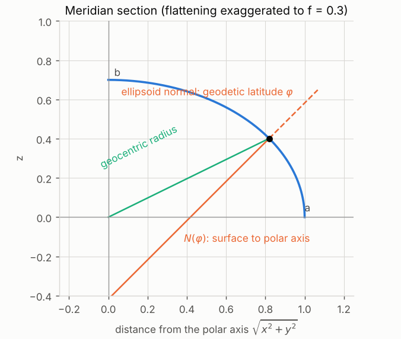
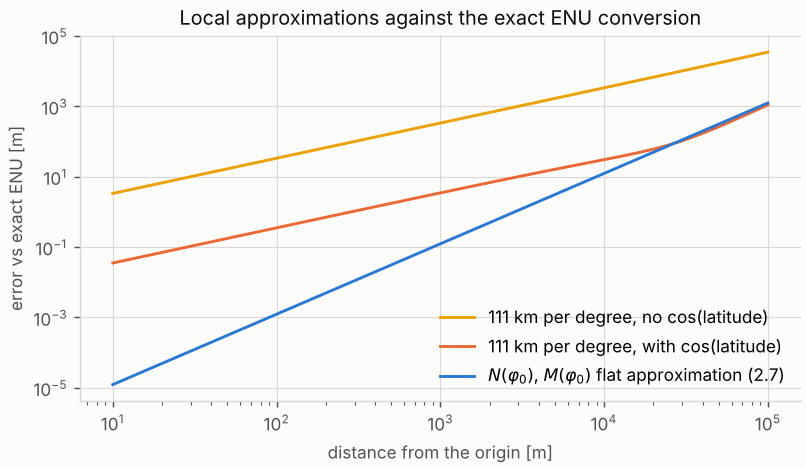
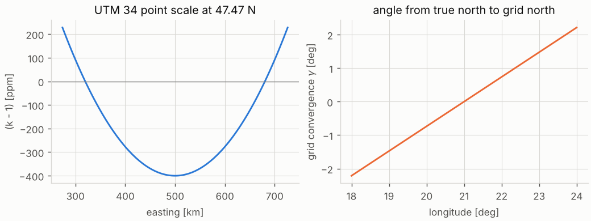

# 2 · Coordinate frames: WGS-84, ECEF, ENU and UTM

A GNSS receiver reports latitude, longitude and height. A filter, a map or a point cloud needs metres in a
Cartesian frame. This chapter builds the chain of conversions between the two and shows how large the
errors of the usual shortcuts are.

Code: [`geodesy.hpp`](../cpp/include/sensor_fusion/geodesy.hpp) ·
tests: [`test_geodesy.cpp`](../cpp/tests/test_geodesy.cpp) ·
notebook: [`02_coordinate_frames.ipynb`](../2_notebooks/solutions/02_coordinate_frames.ipynb)

---

## 2.1 The reference ellipsoid

The Earth is close to an ellipsoid of revolution, flattened at the poles. GPS uses the **WGS-84**
ellipsoid, defined by two numbers: the semi-major (equatorial) axis $a$ and the flattening $f$,

$$
a = 6\,378\,137\ \mathrm{m},\qquad f = 1/298.257223563,\qquad
b = a(1-f),\qquad e^2 = \frac{a^2-b^2}{a^2} = f(2-f).
\tag{2.1}
$$

$b$ is the polar semi-axis and $e^2$ the first eccentricity squared. Every other quantity in this chapter
is derived from $a$ and $f$.

**Geodetic coordinates.** A point is described by

- the **geodetic latitude** $\varphi$: the angle between the equatorial plane and the *ellipsoid normal*
  through the point — not the line to the Earth's centre (that angle is the geocentric latitude,
  Figure 2.1);
- the longitude $\lambda$, east of the Greenwich meridian;
- the **ellipsoidal height** $h$ along the normal. (GNSS heights above mean sea level are $H = h - N_g$,
  chapter 1, eq. 1.8.)

*Figure 2.1 — Geodetic and geocentric latitude on a strongly flattened ellipsoid. The normal at latitude
$\varphi$ meets the polar axis after a length $N(\varphi)$ (`tools/make_figures.py`).*

The length of the normal from the surface to the polar axis is the **prime-vertical radius of curvature**

$$
N(\varphi) = \frac{a}{\sqrt{1 - e^2\sin^2\varphi}} .
\tag{2.2}
$$

## 2.2 ECEF: Earth-centred, Earth-fixed

The ECEF frame $\{E\}$ has its origin at the Earth's centre of mass, $z$ along the rotation axis, $x$
through the intersection of the equator and the Greenwich meridian, $y$ completing a right-handed frame.
It rotates with the Earth. Satellite orbits and the positioning of chapter 1 live here.

**Geodetic to ECEF.** A point on the surface lies at distance $N\cos\varphi$ from the polar axis (Figure
2.1); the normal crosses the axis at $z = -N e^2\sin\varphi$, so the point itself is at
$z = N\sin\varphi - Ne^2\sin\varphi = N(1-e^2)\sin\varphi$. Moving a height $h$ along the normal adds
$h\,[\cos\varphi\cos\lambda,\ \cos\varphi\sin\lambda,\ \sin\varphi]^\top$:

$$
\begin{aligned}
x &= (N + h)\cos\varphi\cos\lambda \\
y &= (N + h)\cos\varphi\sin\lambda \\
z &= \big(N(1-e^2) + h\big)\sin\varphi .
\end{aligned}
\tag{2.3}
$$

**ECEF to geodetic** has no equally simple closed form (closed forms exist — Heikkinen, Vermeille — but are
long). Longitude is immediate, $\lambda = \operatorname{atan2}(y, x)$. For latitude, let
$p = \sqrt{x^2+y^2}$. From (2.3), $p = (N+h)\cos\varphi$ and $z + e^2N\sin\varphi = (N+h)\sin\varphi$, so

$$
\tan\varphi = \frac{z + e^2 N(\varphi)\sin\varphi}{p},
$$

an equation in $\varphi$ alone that can be iterated.

### Algorithm 2.1 — ECEF to geodetic

1. $\lambda = \operatorname{atan2}(y, x)$, $\;p = \sqrt{x^2+y^2}$.
2. Start from $\varphi_0 = \operatorname{atan2}\big(z,\ p(1-e^2)\big)$ (exact for $h=0$).
3. Repeat $\varphi_{k+1} = \operatorname{atan2}\big(z + e^2N(\varphi_k)\sin\varphi_k,\ p\big)$ until
   $|\varphi_{k+1}-\varphi_k| < 10^{-15}$. The map is a contraction with factor of order $e^2\approx 0.0067$,
   so each step gains about two decimal digits.
4. $h = p\cos\varphi + z\sin\varphi - a\sqrt{1-e^2\sin^2\varphi}$. (The textbook $h = p/\cos\varphi - N$
   divides by zero at the poles; this form, obtained by projecting (2.3) onto the normal, does not.)

The tests run 2000 random points from 5 km below the surface to beyond the GNSS orbits and require the
round trip to agree to $10^{-12}$ rad and 10 µm.

## 2.3 ENU: the local tangent plane

For a vehicle, ECEF coordinates are inconvenient: all three change when it drives on flat ground, and the
numbers are in the millions. The **local east–north–up** frame $\{N\}$ has its origin at a chosen point
$(\varphi_0, \lambda_0, h_0)$ — typically the first fix — with axes east, north and along the ellipsoid
normal. Differentiating the unit vector of (2.3) with respect to $\lambda$ and $\varphi$ gives the east
and north directions; "up" is the normal itself. As columns of a rotation matrix:

$$
\mathbf{R}_{EN} =
\begin{bmatrix}
-\sin\lambda_0 & -\sin\varphi_0\cos\lambda_0 & \cos\varphi_0\cos\lambda_0\\
\ \ \cos\lambda_0 & -\sin\varphi_0\sin\lambda_0 & \cos\varphi_0\sin\lambda_0\\
0 & \cos\varphi_0 & \sin\varphi_0
\end{bmatrix}.
\tag{2.4}
$$

With $\mathbf{T}_{EN} = (\mathbf{R}_{EN},\ {}^E\mathbf{p}_0)$ the pose of the ENU frame in ECEF,

$$
{}^{N}\mathbf{p} = \mathbf{R}_{EN}^\top\big({}^{E}\mathbf{p} - {}^{E}\mathbf{p}_0\big),
\qquad
{}^{E}\mathbf{p} = {}^{E}\mathbf{p}_0 + \mathbf{R}_{EN}\,{}^{N}\mathbf{p}.
\tag{2.5}
$$

This is **exact**: ENU is just a rotated and shifted ECEF. What it is not, is a map projection — far from
the origin the ENU plane rises above the curved surface, so a vehicle driving on level ground 10 km away
appears several metres below the plane. For the few hundred metres of a typical localization run it is the
natural frame, and it is the world frame $\{N\}$ of chapters 6–8.

### Shortcuts and their errors

The **meridian radius of curvature** is the radius of the north–south section,

$$
M(\varphi) = \frac{a(1-e^2)}{(1-e^2\sin^2\varphi)^{3/2}} .
\tag{2.6}
$$

A step $\mathrm{d}\varphi$ moves $M\,\mathrm{d}\varphi$ north and a step $\mathrm{d}\lambda$ moves
$N\cos\varphi\,\mathrm{d}\lambda$ east (the radius of the parallel is $N\cos\varphi$, Figure 2.1). Freezing
the radii at the origin gives the **flat-Earth approximation**

$$
e \approx (N_0 + h_0)\cos\varphi_0\,(\lambda-\lambda_0),\qquad
n \approx (M_0 + h_0)\,(\varphi-\varphi_0),\qquad
u \approx h - h_0 .
\tag{2.7}
$$

It is exact to first order. Its leading errors are second order in the distance $s$: the surface drops
below the tangent plane by $(e^2+n^2)/2R$, and the parallels converge, which shifts the east coordinate
by about $e\,n\tan\varphi_0/R$ ($R$ is a mean Earth radius). The tests check this prediction. The cruder
"111 km per degree" rule replaces $M_0$ and $N_0$ by a single constant and so has a *first-order* (relative)
error that never goes away; forgetting the $\cos\varphi_0$ makes east–west distances wrong by the factor
$1/\cos\varphi_0$ — about 1.5 at the latitude of the recorded data. Figure 2.2 compares the three at
47.47° N.

*Figure 2.2 — Error of local approximations against the exact ENU conversion (2.5), for points along the
north-east diagonal (`tools/make_figures.py`).*

| distance | flat approximation (2.7) | 111 km/deg with $\cos\varphi_0$ | 111 km/deg without |
|---|---|---|---|
| 100 m | 1.2 mm | 0.35 m | 33 m |
| 1 km | 0.12 m | 3.5 m | 334 m |
| 10 km | 12 m | 30 m | 3.4 km |

## 2.4 UTM: a map projection

Where a single flat frame must cover a region (a city map, a national grid), a **conformal map projection**
is used: it preserves angles locally, so headings and shapes are correct, at the price of a
position-dependent scale. The **Universal Transverse Mercator** system divides the Earth into 60 zones of
6° longitude; zone $z$ has central meridian $\lambda_z = 6z - 183$ degrees. Each zone uses a transverse
Mercator projection: a cylinder tangent along the central meridian, rotated 90° from the ordinary Mercator.

Two exceptions are part of the standard: south-west Norway uses zone 32 between 3° and 12° E for latitudes
56°–64° N, and around Svalbard (72°–84° N) zones 32, 34 and 36 are not used.

**The projection.** On a sphere the transverse Mercator has a closed form. On the ellipsoid one first maps
the ellipsoid conformally to a sphere by replacing $\varphi$ with the **conformal latitude** $\chi$,

$$
\tau' = \tan\chi = \tau\sqrt{1+\sigma^2} - \sigma\sqrt{1+\tau^2},\qquad
\tau = \tan\varphi,\quad \sigma = \sinh\!\big(e\,\operatorname{artanh}(e\tau/\sqrt{1+\tau^2})\big),
\tag{2.8}
$$

then applies the spherical formulas with $\Delta\lambda = \lambda - \lambda_z$,

$$
\xi' = \operatorname{atan2}(\tau', \cos\Delta\lambda),\qquad
\eta' = \operatorname{arsinh}\!\Big(\frac{\sin\Delta\lambda}{\sqrt{\tau'^2 + \cos^2\Delta\lambda}}\Big),
$$

and finally corrects for the difference between the sphere and the ellipsoid with **Krüger's series** in
the third flattening $n = f/(2-f)$:

$$
\xi = \xi' + \sum_{j=1}^{6}\alpha_j \sin 2j\xi'\cosh 2j\eta',\qquad
\eta = \eta' + \sum_{j=1}^{6}\alpha_j \cos 2j\xi'\sinh 2j\eta',\qquad
A = \frac{a}{1+n}\Big(1 + \frac{n^2}{4} + \frac{n^4}{64} + \frac{n^6}{256}\Big).
\tag{2.9 – 2.10}
$$

The coefficients $\alpha_j$ are polynomials in $n$ (Karney 2011, eq. 35; they are written out in
`geodesy.cpp`). $A$ is the rectifying radius: $A\xi$ is the true distance along the central meridian.
The UTM grid coordinates are

$$
E = E_0 + k_0 A\,\eta,\qquad N = N_0 + k_0 A\,\xi,\qquad
k_0 = 0.9996,\quad E_0 = 500\,000\ \mathrm{m},\quad
N_0 = \begin{cases} 0 & \text{north}\\ 10\,000\,000\ \mathrm{m} & \text{south}\end{cases}
\tag{2.11}
$$

The false easting keeps $E$ positive; the false northing does the same south of the equator.

**Inverse.** The inverse series has the same form with coefficients $\beta_j$,

$$
\xi' = \xi - \sum_{j=1}^{6}\beta_j\sin 2j\xi\cosh 2j\eta,\qquad
\eta' = \eta - \sum_{j=1}^{6}\beta_j\cos 2j\xi\sinh 2j\eta,
\tag{2.12}
$$

followed by $\tau' = \sin\xi'/\sqrt{\sinh^2\eta' + \cos^2\xi'}$,
$\Delta\lambda = \operatorname{atan2}(\sinh\eta', \cos\xi')$ and a Newton iteration that inverts (2.8) for
$\tau$. With six terms the series is far more accurate than any GNSS position (Karney 2011 analyses the
truncation error); the tests compare against PROJ to 10 µm and require round trips to $10^{-12}$ rad.

**Scale and convergence.** The scale $k_0 = 0.9996$ on the central meridian (−400 ppm) grows to about 1.0002
(+228 ppm) at the zone edge at the latitude of the data (Figure 2.3, left): a distance measured on the UTM
grid differs from the true distance by up to 0.4 m per km. The grid north direction
also differs from true north by the **grid convergence** $\gamma \approx \Delta\lambda\sin\varphi$
(Figure 2.3, right). Both are returned by the code; for the parking-lot data in zone 34 they are
$k = 0.99986$ and $\gamma = -1.43°$. A heading taken from UTM coordinates must be corrected by $\gamma$
before it is compared with a compass or an ENU heading.

*Figure 2.3 — Point scale factor and grid convergence across UTM zone 34 at 47.47° N
(`tools/make_figures.py`).*

## 2.5 Which frame when

Velocities and directions rotate with $\mathbf{R}_{EN}^\top$ only, without the translation. A heading
reported as *course over ground* $\chi$ (clockwise from north, chapter 1) is a yaw in ENU
(counter-clockwise from east) of

$$
\psi = \tfrac{\pi}{2} - \chi ,
\tag{2.13}
$$

and a heading measured on the UTM grid must first be corrected by the grid convergence $\gamma$.

| frame | use it for | watch out |
|---|---|---|
| geodetic $(\varphi,\lambda,h)$ | storage, exchange, NMEA, maps | not Cartesian; degrees ≠ metres |
| ECEF | satellite geometry, combining far-apart stations | huge numbers (use double precision), axes not aligned with the vehicle |
| ENU at a local origin | filtering, odometry, local maps (this module) | only within a few km: the plane leaves the surface |
| UTM | maps of a region, sharing coordinates with GIS | scale $k\neq1$, grid north ≠ true north, zone edges |

## 2.6 Common mistakes

- **Swapping latitude and longitude** (GeoJSON, KML and PROJ's `always_xy` use *lon, lat*; NMEA and
  most people use *lat, lon*).
- **Degrees vs radians** in trigonometric functions.
- **"111 km per degree" without $\cos\varphi$** for longitude — 1.5× too long east–west at 47° N.
- **Orthometric height in (2.3).** Use $h = H + N_g$; at the recorded site the difference is 41 m.
- **Rotating positions but not velocities consistently**, or applying the ENU translation to a direction.
- **Course over ground used as an ENU yaw** without (2.13): north-up clockwise vs east-up counter-clockwise.
- **Single precision for ECEF.** A `float` has 24 bits of mantissa, about 0.5 m resolution at 6.4·10⁶ m.
- **Crossing a UTM zone boundary** in the middle of a trajectory: the coordinates jump by hundreds of
  kilometres. Project a whole data set into one zone (the code allows forcing the zone).
- **Ignoring grid convergence** when comparing a UTM-derived heading with a true heading.

## 2.7 References

- National Imagery and Mapping Agency, *Department of Defense World Geodetic System 1984*, TR8350.2, 3rd ed., 2000.
- C. F. F. Karney, "Transverse Mercator with an accuracy of a few nanometers", *Journal of Geodesy* 85(8),
  475–485, 2011 — the series and coefficients used here.
- L. Krüger, *Konforme Abbildung des Erdellipsoids in der Ebene*, Potsdam, 1912.
- J. P. Snyder, *Map Projections — A Working Manual*, USGS Professional Paper 1395, 1987.
- B. Hofmann-Wellenhof, H. Lichtenegger, E. Wasle, *GNSS — Global Navigation Satellite Systems*, Springer,
  2008 — chapter 8 (coordinate transformations).
- P. D. Groves, *Principles of GNSS, Inertial, and Multisensor Integrated Navigation Systems*, 2nd ed.,
  2013 — chapter 2 (coordinate frames, the ECEF/ENU rotation).
- PROJ contributors, *PROJ coordinate transformation software*, https://proj.org (used as the reference in
  the tests and the notebook).
