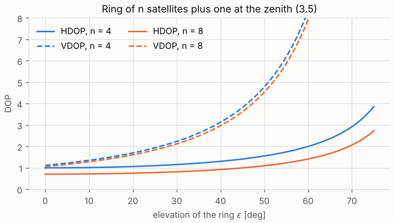
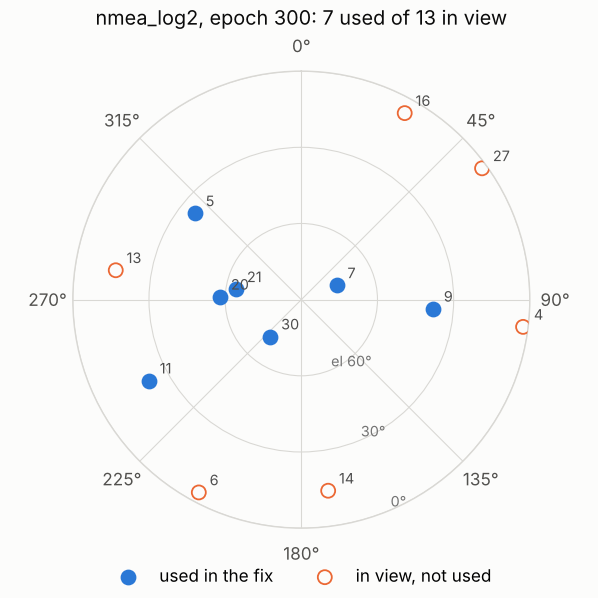
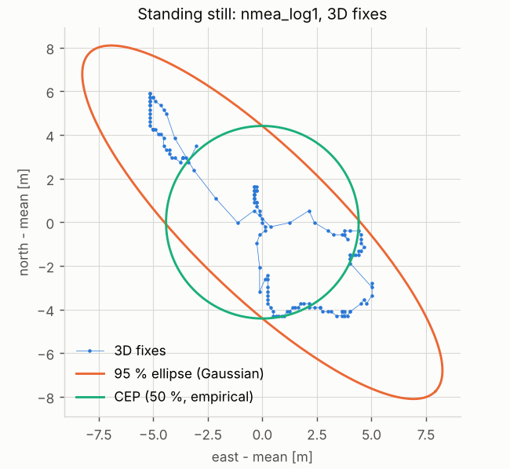
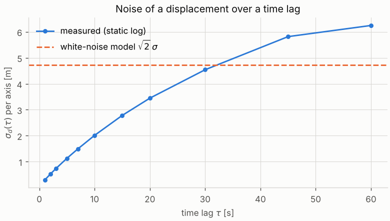

# 3 · GNSS quality: DOP, fix types, satellite geometry, motion vs standstill

A GNSS position without an idea of its quality is dangerous to fuse: chapter 6 needs a covariance for every
fix and a way to reject bad ones. This chapter answers three questions about a GNSS log: *how good can the
fix be given where the satellites are* (DOP), *what kind of fix is it* (fix-type codes), and *how good was
it actually* (precision statistics) — and then uses the answers to decide whether the receiver is moving.

Code: [`gnss_quality.hpp`](../cpp/include/sensor_fusion/gnss_quality.hpp) ·
tests: [`test_gnss_quality.cpp`](../cpp/tests/test_gnss_quality.cpp) ·
notebook: [`03_gnss_quality.ipynb`](../2_notebooks/solutions/03_gnss_quality.ipynb)

---

## 3.1 Dilution of precision

Chapter 1 ended with the covariance of a least-squares fix, $\operatorname{Cov}(\hat{\mathbf x}) =
\sigma_\rho^2(\mathbf G^\top\mathbf G)^{-1}$ (1.4), when all pseudoranges have the same noise $\sigma_\rho$.
The matrix depends only on the directions to the satellites. Written in the local ENU frame, the line of
sight to a satellite at azimuth $\alpha$ (clockwise from north) and elevation $\epsilon$ is
$\mathbf u = [\cos\epsilon\sin\alpha,\ \cos\epsilon\cos\alpha,\ \sin\epsilon]^\top$, so the rows of the
geometry matrix are

$$
\mathbf g_i^\top = \begin{bmatrix} -\cos\epsilon_i\sin\alpha_i & -\cos\epsilon_i\cos\alpha_i & -\sin\epsilon_i & 1\end{bmatrix}.
\tag{3.1}
$$

The azimuths and elevations are exactly what the GSV sentences report, so the geometry of a recorded fix
can be reconstructed from the log. With optional weights $\mathbf W$,

$$
\mathbf Q = (\mathbf G^\top \mathbf W\mathbf G)^{-1} =
\begin{bmatrix} q_{EE} & \cdot & \cdot & \cdot\\ \cdot & q_{NN} & \cdot & \cdot\\ \cdot & \cdot & q_{UU} & \cdot\\ \cdot & \cdot & \cdot & q_{tt}\end{bmatrix},
\qquad \operatorname{Cov}(\hat{\mathbf x}) = \sigma_\rho^2\,\mathbf Q ,
\tag{3.2}
$$

and the **dilution of precision** values are the factors by which the geometry amplifies the range noise:

$$
\mathrm{HDOP} = \sqrt{q_{EE} + q_{NN}},\quad
\mathrm{VDOP} = \sqrt{q_{UU}},\quad
\mathrm{PDOP} = \sqrt{q_{EE} + q_{NN} + q_{UU}},\quad
\mathrm{TDOP} = \sqrt{q_{tt}},\quad
\mathrm{GDOP} = \sqrt{\operatorname{tr}\mathbf Q}.
\tag{3.3}
$$

So a horizontal error of $\sigma_\rho\cdot\mathrm{HDOP}$ is the root of the summed east and north
variances (the DRMS of section 3.3), not a guaranteed bound.

**From an ECEF solution.** The cofactor of chapter 1 is in ECEF. Only its position block must be rotated
(the clock row is frame independent):

$$
\mathbf Q_{ENU} = \mathbf T\,\mathbf Q_{ECEF}\,\mathbf T^\top,\qquad
\mathbf T = \begin{bmatrix}\mathbf R_{EN}^\top & \mathbf 0\\ \mathbf 0^\top & 1\end{bmatrix}.
\tag{3.4}
$$

A rotation does not change the trace, so GDOP and PDOP are the same in both frames; HDOP and VDOP need
(3.4). The tests check that both routes give the same numbers.

### A closed form: the ring and the zenith

Take $n$ satellites spread evenly in azimuth at elevation $\epsilon$, plus one at the zenith. Write
$s=\sin\epsilon$, $c=\cos\epsilon$. By symmetry $\sum\sin\alpha_i=\sum\cos\alpha_i=\sum\sin\alpha_i\cos\alpha_i=0$
and $\sum\sin^2\alpha_i=\sum\cos^2\alpha_i = n/2$, so $\mathbf G^\top\mathbf G$ splits into a horizontal
block $\tfrac{n}{2}c^2\mathbf I_2$ and a vertical–clock block

$$
\begin{bmatrix} n s^2 + 1 & -(ns+1)\\ -(ns+1) & n+1\end{bmatrix},
\qquad \det = n(1-s)^2 .
$$

Inverting each block:

$$
\mathrm{HDOP} = \frac{2}{c\sqrt n},\qquad
\mathrm{VDOP} = \sqrt{\frac{n+1}{n(1-s)^2}},\qquad
\mathrm{TDOP} = \sqrt{\frac{ns^2+1}{n(1-s)^2}} .
\tag{3.5}
$$

Three lessons, all visible in Figure 3.1. HDOP is smallest when the ring is **low**: horizontal precision
comes from satellites near the horizon. VDOP explodes as the ring rises towards the zenith satellite,
because vertical position and clock bias then enter every range almost identically — they become
indistinguishable. And more satellites help, but only as $1/\sqrt n$. Real skies have no satellites below
the horizon to mirror those above, which is why VDOP is normally larger than HDOP.

*Figure 3.1 — HDOP (solid) and VDOP (dashed) of the ring-plus-zenith constellation (3.5)
(`tools/make_figures.py`).*

**Elevation weighting.** Low satellites have longer paths through the atmosphere and more multipath. A
common model is $\sigma_i \propto 1/\sin\epsilon_i$, i.e. $w_i = \sin^2\epsilon_i$; the code supports any
weights in (3.2). Weighted DOP is no longer a pure geometry number — it mixes geometry and noise model —
so compare only like with like.

### DOP in the recorded logs

The receiver reports PDOP, HDOP and VDOP in GSA. Recomputing them from the GSV azimuths and elevations of
the satellites listed in GSA is a strong check of both the decoder and the understanding. Figure 3.2 shows
the sky at one epoch of the walk; there the computed values are PDOP 2.49, HDOP 1.59, VDOP 1.92 against the
reported 2.47, 1.58, 1.90 — the residual difference comes from GSV rounding elevations and azimuths to
whole degrees.

*Figure 3.2 — Sky plot of `nmea_log2` at epoch 300 (`tools/make_figures.py`).*

Over the whole logs the picture is less tidy: the reported PDOP agrees with the GPS-only geometry to
within 0.1 in only 28 of 135 epochs (log 1) and 42 of 325 epochs (log 2). In the other epochs the receiver
alternates to a second, markedly lower set of DOP values (for example VDOP 0.97 where the GPS satellites
give 3.8). Such low values need more satellites than the GSA sentence lists, which is consistent with a
receiver that also tracks another constellation or SBAS but writes only `GP` sentences — TODO: the receiver
model and its constellation settings are not recorded with the logs. The lesson stands either way: a DOP
field is only interpretable if you know which satellites it refers to.

## 3.2 Fix types

Receivers report *what kind* of solution they produced in several places, and the codes do not line up
one to one.

| source | field | values |
|---|---|---|
| NMEA GGA | fix quality | 0 invalid · 1 GPS (standard positioning) · 2 differential (DGPS/SBAS) · 4 RTK fixed · 5 RTK float · 6 dead reckoning · 7 manual · 8 simulator |
| NMEA GSA | fix type | 1 no fix · 2 2D · 3 3D |
| NMEA RMC | status / mode | `A` valid, `V` void / `A` autonomous, `D` differential, `E` estimated, `N` not valid |
| ROS `NavSatFix` | `status.status` | −1 no fix · 0 fix · 1 SBAS-augmented · 2 ground-based augmentation (DGPS, RTK) |
| ROS `NavSatFix` | `position_covariance_type` | 0 unknown · 1 approximated · 2 diagonal known · 3 known |

- A **2D fix** (GSA type 2) solves for latitude, longitude and clock with three satellites and a fixed
  height (chapter 1). Its horizontal position absorbs any height error; do not mix 2D and 3D fixes in
  precision statistics.
- **RTK fixed** (quality 4) resolves the carrier-phase integer ambiguities and is centimetre-level;
  **RTK float** (5) has not, and can be metres off. The difference matters more than any DOP.
- A ROS driver maps the NMEA quality to a `NavSatStatus` and *invents* a covariance from HDOP and a
  per-quality constant (`position_covariance_type = 1`, "approximated"). In the parking-lot logs most fixes
  carry status 2 with horizontal variances of 13–71 m², but the last 48 fixes of run 1 report
  0.0003–0.0005 m² (about 2 cm) under the same status, and run 3 has 66 fixes with status 1 and
  0.01–0.04 m². Which receiver mode produced which is not recorded (TODO). Treat approximated covariances as hints to be checked against
  the data, as chapter 6 does with an innovation test.

## 3.3 How good was the fix? Precision statistics

For a receiver standing still the truth is constant, so the scatter of the fixes about their mean measures
**precision** (repeatability). **Accuracy** — the distance to the true position — needs a surveyed
reference and cannot be estimated from the log alone; a constant bias is invisible here.

With horizontal positions $\mathbf p_k = [e_k, n_k]^\top$, mean $\bar{\mathbf p}$ and sample covariance
$\boldsymbol\Sigma$:

$$
\sigma_E,\ \sigma_N = \sqrt{\Sigma_{11}},\ \sqrt{\Sigma_{22}},\qquad
\mathrm{DRMS} = \sqrt{\sigma_E^2+\sigma_N^2},\qquad
\mathrm{CEP} = \operatorname{median}_k \lVert\mathbf p_k - \bar{\mathbf p}\rVert,\qquad
R95 = 95\text{th percentile of } \lVert\mathbf p_k - \bar{\mathbf p}\rVert .
\tag{3.6}
$$

CEP (circular error probable) and R95 are *empirical* radii; DRMS and 2DRMS are moments. For a circular
Gaussian with per-axis $\sigma$ the radius is Rayleigh distributed, CEP $=\sigma\sqrt{2\ln 2}\approx
1.18\sigma$ and R95 $= \sigma\sqrt{-2\ln 0.05}\approx 2.45\sigma$; the tests check the code against these.

**Confidence ellipse.** For a 2-D Gaussian with covariance $\boldsymbol\Sigma = \mathbf V\operatorname{diag}(\lambda_1,\lambda_2)\mathbf V^\top$,
the squared Mahalanobis distance $(\mathbf p-\bar{\mathbf p})^\top\boldsymbol\Sigma^{-1}(\mathbf p-\bar{\mathbf p})$
is $\chi^2$ with two degrees of freedom, whose distribution function is $1-e^{-c/2}$. The ellipse holding
probability $P$ therefore has semi-axes

$$
a_{1,2} = \sqrt{c\,\lambda_{1,2}},\qquad c = -2\ln(1-P),
\tag{3.7}
$$

along the eigenvectors. The "1-σ ellipse" ($c = 1$) holds only 39.3 %; the 95 % ellipse has
$c = 5.99$.

Figure 3.3 applies this to the static log (3D fixes only). The fixes do not scatter like independent
Gaussian samples; they **wander**: the position drifts slowly as satellites move and atmospheric delays
change. The per-axis standard deviations are 3.4 m and 3.3 m, CEP 4.4 m, R95 7.6 m. Including the 2D fixes
of the cold start inflates the scatter noticeably — the notebook shows by how much.

*Figure 3.3 — Static receiver: fixes relative to their mean, Gaussian 95 % ellipse and empirical CEP
(`tools/make_figures.py`).*

## 3.4 Moving or standing still?

Detecting standstill is useful in its own right (zero-velocity updates, freezing a map, choosing data for
precision statistics) and is a first example of a **statistical test on GNSS data**. Two signals are
available:

1. **Receiver speed** (RMC, VTG). It is computed from Doppler shifts, not from differenced positions, and
   is much less noisy than positions. A threshold on it works well when the receiver provides it — but
   the static log still reports speeds up to 0.64 m/s.
2. **Displacement over a window.** If the receiver stands still, the displacement
   $\Delta\mathbf p = \mathbf p(t) - \mathbf p(t-\tau)$ is pure noise. With per-axis standard deviation
   $\sigma_d(\tau)$ of that noise,

$$
d^2 = \frac{\lVert\Delta\mathbf p\rVert^2}{\sigma_d(\tau)^2} \sim \chi^2_2
\quad\text{when standing; decide "moving" if } d^2 > \chi^2_2(1-p_{fa}),
\tag{3.8}
$$

   with $p_{fa}$ the accepted false-alarm probability per test ($\chi^2_2(0.999) = 13.8$).

**The catch: $\sigma_d$ is not $\sqrt2\,\sigma$.** If the fixes had independent errors with per-axis
$\sigma$, the difference of two would have $\sigma_d = \sqrt2\sigma$ for any lag. GNSS errors are strongly
correlated in time; a first-order Gauss–Markov model with correlation time $T$ gives

$$
\sigma_d(\tau)^2 = \tfrac12 \operatorname{E}\lVert\mathbf p(t+\tau)-\mathbf p(t)\rVert^2 = 2\sigma^2\left(1 - e^{-\tau/T}\right),
\tag{3.9}
$$

which is much smaller than $2\sigma^2$ for $\tau \ll T$. Figure 3.4 measures $\sigma_d(\tau)$ on the static
log: 0.30 m at 1 s, 1.13 m at 5 s, 2.0 m at 10 s — far below the white-noise value
$\sqrt2\cdot3.3\approx4.7$ m at short lags. (Beyond a minute the estimate exceeds it: the log is too short
for the wander to average out.) Using
$\sigma_d = \sqrt2\cdot 3.4$ m in (3.8) would make walking at 1 m/s undetectable over 5 s; using the
measured 1.13 m detects it. **Calibrate the test on data of the same receiver standing still.**

*Figure 3.4 — Per-axis noise of a displacement over lag $\tau$, static log, against the white-noise model
(`tools/make_figures.py`).*

### Algorithm 3.1 — motion classification

1. For every epoch $t_i$ find the latest epoch $t_j \le t_i - \tau$; if none, no position test.
2. Compute $d^2_i$ by (3.8) with the calibrated $\sigma_d(\tau)$; *moving* if $d^2_i > \chi^2_2(1-p_{fa})$.
3. If a receiver speed is available and exceeds $v_{th}$, *moving*.
4. **Hysteresis**: accept a change of state only if the new state persists for $m$ consecutive epochs.
   Single-epoch outliers then do not toggle the label.
5. Expect a delay of up to $\tau$ at every transition — the price of averaging.

With $\tau = 5$ s and $\sigma_d = 1.13$ m the classifier labels 4 % of the 3D epochs of the static log as
moving (the wander of Figure 3.3 occasionally exceeds the threshold). On the walk it labels 86 % as moving
from positions alone and 96 % when the receiver speed is added — the walker did stop now and then, so
neither number is an error rate.

## 3.5 Common mistakes

- **"Error = HDOP × 5 m."** HDOP multiplies the *pseudorange* noise $\sigma_\rho$, which is not known a
  priori, and the product is a DRMS, not a bound. Use it to compare geometries, not as a covariance.
- **Recomputing DOP from the wrong satellites** — all in view instead of those used, or GSV of a
  different epoch.
- **Mixing 2D and 3D fixes** (or RTK float and fixed) in one statistic.
- **Calling a standard deviation "accuracy".** Without ground truth it is precision.
- **Assuming white noise.** Differences of nearby fixes are far more precise than single fixes; averages
  of correlated fixes are far less precise than $\sigma/\sqrt n$ suggests.
- **A speed threshold without hysteresis** — the label flickers at every noisy epoch.

## 3.6 References

- P. Misra and P. Enge, *Global Positioning System: Signals, Measurements, and Performance*, 2nd ed.,
  2006 — section 6.1 (DOP) and chapter 7 (error budgets, correlation of errors).
- R. B. Langley, "Dilution of precision", *GPS World*, May 1999, 52–59.
- F. van Diggelen, *GNSS Accuracy: Lies, Damn Lies, and Statistics*, GPS World, January 2007 — CEP, DRMS,
  R95 and their relations.
- P. D. Groves, *Principles of GNSS, Inertial, and Multisensor Integrated Navigation Systems*, 2nd ed.,
  2013 — sections 9.4 (DOP) and 17.2 (integrity, fault detection).
- ROS `sensor_msgs/NavSatFix` and `NavSatStatus` message definitions,
  https://docs.ros2.org/latest/api/sensor_msgs/msg/NavSatFix.html.
- NMEA 0183 Standard, version 4.11 (GGA, GSA, GSV, RMC field definitions).
