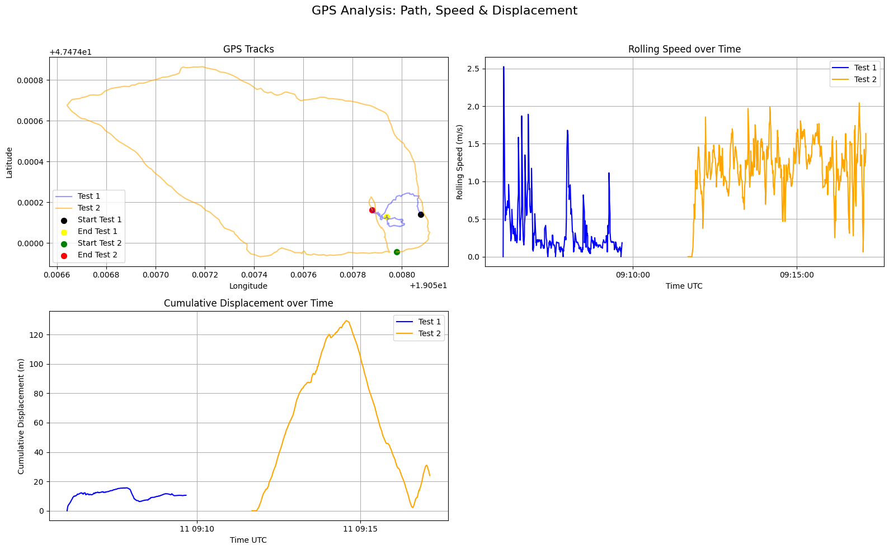
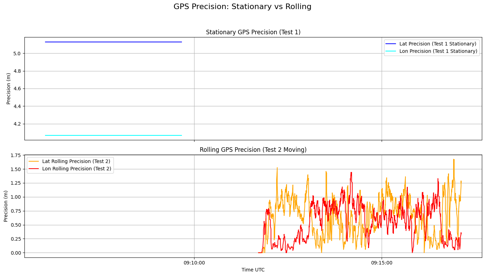
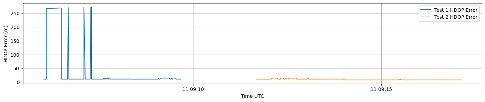
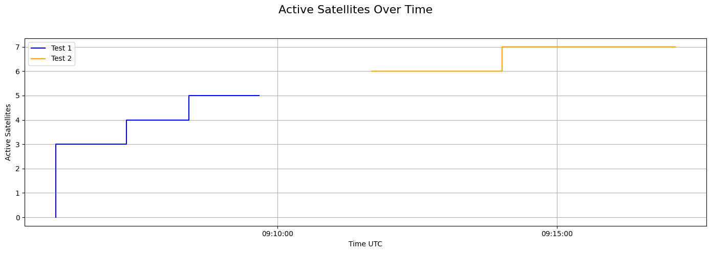

# GPS / GNSS Data Analysis

Decoding and analysis of raw **GNSS receiver data in NMEA 0183 format**, collected with a low-cost
GPS receiver and processed into position, speed, precision and satellite-quality metrics.

This project was produced for the course **Introduction to Vehicles and Sensors** (IFRoS / ELTE),
and demonstrates a complete pipeline that takes raw `$GPGGA / $GPRMC / $GPGSA / $GPGSV / $GPVTG`
sentences and answers three practical questions about a GPS log: *is the receiver moving, how
precise is it, and how good is the fix?*

> **Full write-up:** [`GNSS_GPS_Decoding.pdf`](GNSS_GPS_Decoding.pdf)
> **Notebook:** [`GNSS _ GPS Decoding and Analysis.ipynb`](GNSS%20_%20GPS%20Decoding%20and%20Analysis.ipynb)

---

## 1. Objective

Two GPS logs were recorded on **04 November 2025** near ELTE (Budapest, ≈ 47.474° N, 19.058° E)
and the analysis was asked to determine:

1. **Movement detection** – which log is *stationary* and which is *moving*, and what kind of
   motion the moving track represents (standing, walking, or circling).
2. **Precision / accuracy** – estimate the GPS repeatability in **metres** from the stationary
   period, comparing latitude vs. longitude scatter.
3. **Additional insights** – extract satellite count, fix quality, HDOP, altitude and speed from
   the NMEA stream and use them to explain *why* the two logs differ in quality.

---

## 2. Data

| File | Description |
|------|-------------|
| `data/nmea-test1-1.txt` | Raw NMEA 0183 sentences — **Test 1** |
| `data/nmea-test2-1.txt` | Raw NMEA 0183 sentences — **Test 2** |
| `data/nmea_analyser-details1-1.csv` | Test 1 decoded to tabular form |
| `data/nmea_analyser-details2-1.csv` | Test 2 decoded to tabular form |

The raw `.txt` logs were decoded with the online
[NMEA Analyser](https://swairlearn.bluecover.pt/nmea_analyser), which expands each sentence into
columns: `Date, Time UTC, Latitude, Longitude, Altitude, Fix, Fix quality, PDOP, HDOP, VDOP,
Inview Sats, Active sats` and the per-constellation active-satellite counts (GPS / GLONASS /
Galileo / BeiDou).

A raw record looks like this:

```
$GPGGA,090550.000,,,,,0,2,,,M,,M,,*43        ← no fix yet (quality 0), 2 sats
$GPGSA,A,1,,,,,,,,,,,,,,,*1E                  ← fix type 1 = no fix
$GPRMC,090550.000,V,,,,,0.11,43.24,041125,,,N*76   ← 'V' = data invalid
$GPVTG,43.24,T,,M,0.11,N,0.21,K,N*00          ← course/speed over ground
```

| Log | Time span (UTC) | Duration | Valid fixes | Avg HDOP | Avg active sats |
|-----|-----------------|----------|-------------|----------|-----------------|
| **Test 1** | 09:05:50 → 09:09:40 | ≈ 3 min 50 s | 920 | **8.86** | ≈ 4.0 |
| **Test 2** | 09:11:41 → 09:17:07 | ≈ 5 min 26 s | 1373 | **1.88** | ≈ 6.6 |

Test 1 begins **before the receiver has a fix** (the first dozens of sentences carry empty
coordinates and `Fix quality = Invalid`) — this is the cold-start acquisition phase and it
dominates Test 1's poor average HDOP.

---

## 3. Analysis Pipeline

The notebook implements the following steps in Python (`pandas`, `numpy`, `geopy`, `matplotlib`):

1. **Load & inspect** the decoded CSVs.
2. **Clean** — drop rows without latitude/longitude, cast coordinates to float, merge
   `Date + Time UTC` into a single datetime, drop invalid timestamps.
3. **Motion** — compute rolling speed and cumulative displacement between fixes using the
   **geodesic distance** (`geopy.distance.geodesic`) divided by the time delta.
4. **Precision** — standard deviation of latitude/longitude during the stationary log, converted
   from degrees to metres.
5. **HDOP error** — expected horizontal error ≈ `HDOP × nominal_error` (nominal = 5 m).
6. **Satellite statistics** — in-view vs. active satellites, HDOP and altitude over time.

### Degrees → metres conversion

GPS scatter is measured in degrees of latitude/longitude and converted to metres with:

```
lat_metres = σ_lat × 111 000
lon_metres = σ_lon × 111 000 × cos(mean_latitude)
```

The `cos(latitude)` factor accounts for meridian convergence — one degree of longitude is shorter
than one degree of latitude away from the equator (here cos 47.47° ≈ 0.676).

---

## 4. Results

### 4.1 Movement — path, speed & displacement



- **Test 1 (blue)** stays inside a tight cluster a few metres across; its rolling speed mostly sits
  below ~0.3 m/s (the early spikes are acquisition jitter, not real motion) and its cumulative
  displacement plateaus around **10–15 m**. → **Stationary.**
- **Test 2 (orange)** traces a **closed loop** that returns close to its start; speed holds a steady
  **~1–2 m/s** (typical walking pace) and cumulative displacement rises to a peak of **≈ 130 m**
  before coming back down as the walker returns. → **Moving — walking a loop on foot.**

### 4.2 Precision — stationary vs. rolling



**Stationary repeatability (Test 1):**

| Direction | 1σ precision |
|-----------|--------------|
| Latitude  | **5.13 m** |
| Longitude | **4.07 m** |

The ~5 m scatter is consistent with a standard consumer single-frequency GPS. Latitude scatter is
slightly larger than longitude here, but both are within the expected few-metre envelope.

For Test 2, a fixed standard deviation is meaningless (the receiver is genuinely moving), so a
**rolling** standard deviation over a 10-point window is used instead. It stays in the **0–1.5 m**
band, capturing short-term measurement noise rather than the real motion.

### 4.3 Fix quality — HDOP-based horizontal error



Horizontal error estimated as `HDOP × 5 m`:

- **Test 1** spikes to **~270 m** during cold-start acquisition (HDOP up to ~54 while only 2–4
  satellites are locked), then settles toward ~10 m once the geometry improves.
- **Test 2** stays flat and low (**~10 m**, HDOP ≈ 1.9) — a clean, well-conditioned fix throughout.

This is the clearest explanation of the quality gap between the two logs: it is driven by
**satellite geometry**, not by motion.

### 4.4 Satellite count



| | In-view sats | Active sats | Avg HDOP | Avg altitude |
|--|--------------|-------------|----------|--------------|
| **Test 1** | 7.9 | ~4 (ramps 0→5) | 8.86 | 148.9 m |
| **Test 2** | 14.0 | ~6.6 (6→7) | 1.88 | 144.6 m |

Test 2 sees roughly **twice** as many satellites and locks onto more of them, which is exactly why
its HDOP — and therefore its position error — is so much lower.

---

## 5. Answers to the Questions

**Q1 — Movement detection**
Test 1 is **stationary** (tight cluster, near-zero speed, flat displacement). Test 2 is **moving**:
a person **walking a closed loop** at ~1–2 m/s, ~130 m out and back.

**Q2 — Precision / accuracy**
Stationary repeatability is **≈ 5 m in latitude and ≈ 4 m in longitude** (1σ). The HDOP-based
horizontal-error estimate is consistent with this once the fix has stabilised (~10 m at HDOP ≈ 2).

**Q3 — Additional insights**
Fix quality is governed by satellite availability and geometry: Test 1's poor early HDOP comes from
its cold start with few satellites, while Test 2's larger, well-distributed constellation (≈ 14
in view) yields a steady, low-error fix. Altitude is consistent (~145–149 m) across both logs.

---

## 6. Repository Layout

```
GPS_GNSS_Data_Analysis/
├── GNSS _ GPS Decoding and Analysis.ipynb   # full analysis notebook
├── GNSS_GPS_Decoding.pdf                     # exported report
├── data/                                     # raw NMEA logs + decoded CSVs
│   ├── nmea-test1-1.txt
│   ├── nmea-test2-1.txt
│   ├── nmea_analyser-details1-1.csv
│   └── nmea_analyser-details2-1.csv
├── results/                                  # generated figures
│   ├── 1.png   # path, speed & displacement
│   ├── 2.png   # stationary vs rolling precision
│   ├── 3.png   # HDOP-based horizontal error
│   └── 4.png   # active satellites over time
└── README.md
```

## 7. Reproducing

```bash
pip install pandas numpy matplotlib geopy
jupyter notebook "GNSS _ GPS Decoding and Analysis.ipynb"
```

The notebook was originally run in Google Colab; to run it locally, replace the
`google.colab.files.upload()` cell with direct reads of the CSVs from `data/`, e.g.

```python
df1 = pd.read_csv('data/nmea_analyser-details1-1.csv', sep=',', skiprows=1)
df2 = pd.read_csv('data/nmea_analyser-details2-1.csv', sep=',', skiprows=1)
```

---

*Course: Introduction to Vehicles and Sensors — IFRoS / ELTE.*
